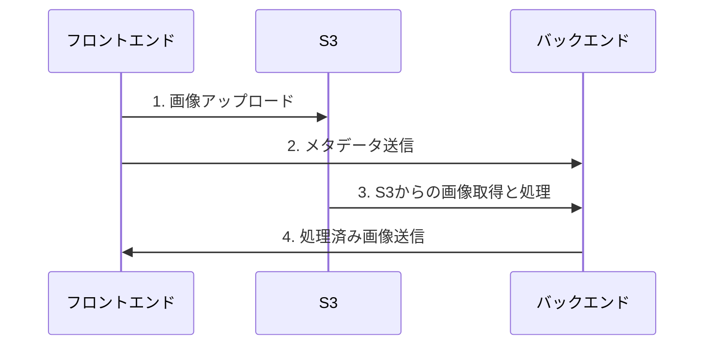

こんにちは。ナンバーナインで学生インターンとして働いている、東京工業大学工学院 情報通信系 4 年の mehm8128 です。
普段は所属サークルの traP で技術記事を出しているのですが、今回ナンバーナインでも記事を書く機会をいただきました。今回はナンバーナインのサービスの Next.js 移行に参加した話と、その後の改修についての話を書いていきます。

https://no9.co.jp

ナンバーナインのサービス(以降 no9 と略します)は、以前はフロントエンドが Angular で書かれていたのですが、流行りや今後のエンジニア採用等を考えて、約 2 年かけて Next.js へ移行しました。
僕はこのプロジェクトが開始してから約半年後に学生インターンとして参加し、メインで開発を進めていました。先日、全ページの Next.js 移行が完了したので、その概要について書いていきます。

## 移行作業について

### 移行の流れ

大きな方針として、**Angular と Next.js を共存させ、ページごとに出し分ける**という方針が決まっていました。これはリプレイスの影響を最小限に抑えられたり、少しずつリリースすることでフィードバックを受けて改善までのサイクルが回しやすかったりといったメリットがあります。

その上で、大まかにこのような順番にリプレイスを進めました。

1. Angular と Next.js の共存ができるか検証

両者のページを交互に切り替えられるかどうか、認証状態を保ったままその切り替えができるかどうか等を検証しました。
ローカルでは`next.config.js`のリダイレクト設定、本番やプレビュー環境では Vercel のリダイレクト設定で URL を設定して、リプレイスしたページは Next.js 側が表示されるようにしていました。

2. 新たに機能を追加したり設計をしたりしなくてよい画面のリプレイス

僕はこのあたりからインターンに参加しました。
移行前の画面をデザインだけ少し改善して、機能や要件はそのままリプレイスしました。

3. 作品データ登録画面のリプレイス

no9 のメインの部分です。以下の取締役 COO 工藤さんのポストで取り上げられているような台割調整機能を今回新たに追加したので、新しくデザインや設計をちゃんと考える必要がありました。

https://x.com/yudai112535/status/1655919698398289933

4. 認証周り

時間の都合で、いくつか小さなページはこのタイミングまで Angular のまま残っていたのですが、認証周りは意図的に終盤まで残していました。
Angular との出し分けのコアの部分だったので、認証が必要な Angular のページが全て移行完了するまで残していました。

5. LP

no9 を使おうとする人が最初にアクセスするのは LP(https://no9.co.jp) です。デザイナーさんに時間をかけて新デザインを作ってもらい、1 ヶ月ほどかけて実装しました。僕は 6 ～ 7 割くらい実装したと思います。

### 主な技術スタック

移行当時の技術スタックで、現在は一部変わっていますが、大体このようなものを使用しています。

- [Next.js](https://nextjs.org/)
- [SWR](https://swr.vercel.app/ja)
- [Connect](https://connectrpc.com/)
- [React Hook Form](https://react-hook-form.com/)
- [Zod](https://zod.dev/)
- [styled-components](https://styled-components.com/)
- [twin.macro](https://github.com/ben-rogerson/twin.macro)
- [Storybook](https://storybook.js.org/)
- [Chromatic](https://www.chromatic.com/)

### 作品データ登録画面

今回のアップデートでの一番の目玉機能が作品データ登録画面なので、この画面についてメインで説明します。

この画面には、以下の動画のようなアップロード機能があります(最近のアップデートで、これよりさらに新しい画面になりました)。

https://x.com/yudai112535/status/1645428845561122816

今までは作家さんには作品データを Google Drive にアップロードしていただいていたのですが、以下の理由からサービス内で管理できるようにしたいということで、今回のような機能ができました。

1. セキュリティ上の理由
2. ファイル名の命名規則が統一できず、ページ順等を揃える手間がある
3. 画像データのサイズ調整等を自動化したい
4. 作家さん側で台割を設定できるようにしたい

アップロードした画像をリアルタイムで処理し、それを反映させるために Connect を利用してサーバーから server streaming されたものを受け取っています。また、protobuf を用いることでバックエンドとフロントエンドの間で型安全に通信ができるようにしています。

ページ画像をアップロードしたときの流れは以下のようになっています。

1. 画像をフロントエンドから直接 S3 にアップロード
2. バックエンドにアップロードした画像のメタデータを送信
3. バックエンドはそのメタデータを元にして S3 から画像を取得し、処理を行う
4. 処理が終わり次第フロントエンドに画像が降ってきて、表示



バックエンドでの処理は主にリサイズと jpeg 化で、圧縮したり、扱うデータの形式を統一したりといったことをしています。

また、先ほど見ていただいたようにドラッグアンドドロップでページを入れ替えられるようになっていますが、この実装には [dnd-kit](https://dndkit.com/) を使いました。最初は自力で実装しようと思ったのですが、アニメーション部分の実装が難しかったり、コードがかなり煩雑になってしまいそうだったのでライブラリに委ねることにしました。

情報を入力する部分は React Hook Form + Zod でバリデーションを行っています。この画面だけでなく、他の画面のフォームも基本この組み合わせでバリデーションを行うようにしています。

### VRT

今回の開発では Storybook を用いているのですが、VRT で差分チェックをしたいという issue が立っていました。そこでちょうど当時知ったばかりだった、Chromatic というサービスの使用を提案しました。Storybook 公式でも推奨されていることもあって、無料枠だと 1 ヶ月 5000 snapshot までという制約はありながらも使ってみることになりました。
Chromatic は今でも使い続けていて、最近だと Storybook v8 から Storybook 上でも Chromatic を用いて前回の画像との比較ができるようになったりしているので、今後更に Storybook との連携がいい感じになるのではないかと思っています。
また、Chromatic は VRT だけでなく、Storybook の publish 及びレビュー等もできるので、今後デザイナーチームとのコミュニケーションに上手く利用していけたらと考えています。

https://www.chromatic.com/

## 移行完了後の改修

作品データ登録が新 UI でできるようになったら、LP やその他残っているページを一旦置いておいてリファクタリング及び改修をした期間がありました。大きなものをいくつか紹介します。

### App Router 移行

ちょうど僕がナンバーナインに入ったくらいのタイミングで、[Next.js 13](https://nextjs.org/blog/next-13) が出て App Router の beta 版が出ていました。今後主流になっていくようならサービスが小さいうちに App Router 移行したいねという話が出ていて、[Next.js 13.4](https://nextjs.org/blog/next-13-4) が出て stable になったタイミングで本格的に移行の検討が始まりました。
結局、元々のディレクトリ構成が微妙だと感じていたのでそこをリファクタリング(後述)してから、App Router 移行をしました。移行作業自体は僕が一人で行い(もちろんレビュー等をもらいながらですが)、1 ヶ月程度で終えることができました。
こういった大きな移行作業に慣れていなくて、直接 App Router 移行に関係ないリファクタリング等も含めて 1 つの PR にまとめてしまっていたりしたのですが、アドバイスをもらいながらいい感じに分割して PR を出していき、なんとかリファクタリングも App Router 移行も完了できました。

### ディレクトリ構造のリファクタリング

元々このプロジェクトでは、Atomic Design のようなものが採用されていました。page, template, organisms, components の順に単位が小さくなっていたのですが、organisms と components の違いが明確でなかったり、そのときちょうど features ディレクトリが話題になっていて、レイヤーではなくて機能ごとに分けていくのがよさそうだったりということで、ディレクトリ構造の改修を提案しました。
また、通信周りが 1 つのモデルに対して 1 つのファイルに全て収まっていて(例えばユーザーなら`user.ts`、作品なら`title.ts`など)、ファイルが肥大化してしまっていたので、こちらも分けることを提案しました。
相談を重ね、最終的に以下のような構造になりました(今回関係あるものだけ書いています)。

```
- app/  -- appディレクトリ
  - _components  -- このページでのみ使うコンポーネント
  - page.tsx
  - _template.tsx  -- ここはAtomic Designのtamplateのようなものを残している(template.tsxは予約語なのでアンダースコアをつけています)
  - schema.ts  - フォームなどでスキーマを使うページの場合、ここでスキーマ定義
- clients/  --  通信周り
  - apis/  --  実際の通信処理
  - schemas/  --  型定義と、サーバーからのデータをフロントで扱いたいデータに変換
- components/  -- 汎用コンポーネント
- hooks/ など
```

特にコンポーネントについては、汎用コンポーネントは components 内、それ以外は基本 app ディレクトリ内の各`_components`に収めるような方針にしました。

ただ、これで 1 年使ってみて clients ディレクトリがまだ使いにくいと感じていたので、この中も関心ごとにまとめるようにしました。具体的には以下のような構造に変更しました。

```
- clients/
  - title/
    - api.ts
    - schema.ts
    - converter.ts  -- サーバーのデータとフロント用データの変換
  - user/ など
```

こうすることで関心ごとにまとまり、ファイルが扱いやすくなりました。
また、今まで`schema.ts`で行っていたデータの変換処理を、別のファイルに切り出すこともできるようになりました。

### SWR を Tanstack Query に移行

これは LP なども完全に移行が終わった後の話です。
Suspense を使ってページの表示速度を改善したいという話が出ていて Suspense を使えるようにしたかったのですが、SWR のままだとどうも上手くいかなさそうな箇所が何箇所かあり、Tanstack Query に移行することにしました。
Connect の Unary 通信でも扱いたかったのですが、[@connectrpc/connect-query](https://connectrpc.com/docs/web/query/getting-started/)というライブラリがあったのでこれを使うことにしました。
結果としてはいい感じに移行 & Suspense 対応ができました。
今まで`page.tsx`で全てのデータを取ってきて、`_template.tsx`に渡すようにしていたのですが、今後は`_template.tsx`を作らずに必要なコンポーネントで必要なものを取ってくればよくなります。

ちなみに、Connect での通信は Storybook 上でモックするときに msw が使えないので、[createRouterTransport 関数](https://connectrpc.com/docs/web/testing/#mocking-transports)を用いてモックするようにしています。

### テストを書く

最初のリニューアルまではかなり速度を重視していたこともあり、Storybook を使っていながらもちゃんとテストの整備ができていなくて、Testing Library も依存関係としては入っていたのですが使われていない状態でした。そこで、後述のデザインシステムなどを導入後のタイミングで、テストの整備をしました。主に以下の 2 つです。

1. ロジックのテスト
   ロジックのテストは、Vitest を用いてすることにしました。
   テストを書く基準としてはちょっと頭を使わないと読み解けないようなロジックを書いたときや、修正を入れるときにバグが起こりやすそうなロジックを書いたときとしています。
2. コンポーネントテスト
   コンポーネントのテストは [Storybook の play 関数内で @storybook/test を用いて](https://storybook.js.org/docs/writing-tests/interaction-testing)行うようにしています。これを使うことで、Storybook 上で対象のコンポーネントを開いたときに自動でテストが走り、指定したインタラクションを起こしたときに上手く動いてくれることを確認できます。
   Next.js 移行をした当初は全部のコンポーネントに対して Story を書くことで、1 つ 1 つが雑になってしまっていたのですが、現在はフォームなどインタラクションを含むものや、重要なコンポーネントに絞ることで 1 つ 1 つのテストをちゃんと書くことができています。

play 関数の例として、以下のような著者情報を登録するフォームコンポーネントを紹介します。

1. 「区分」でセレクトボックスで「作画」という選択肢を選択
2. 「作家名」で「test」という文字列を入力
3. 「作家名(カナ)」で「テスト」という文字列を入力
4. 「送信」ボタンをクリック
5. 「送信」ボタンをクリック時に呼ばれる関数が、今入力した情報をまとめたオブジェクトの引数を用いて呼ばれるを確認(@storybook/test の`fn`関数を用いています)

という一連の流れをテストできるようになっています。


フロントエンドでテストを書くことは主に以下の 3 つの意味があると思っています。

1.動作を保証できる
最初に思いつくのがこれだと思います。自動テストをできるようにすることで、変更を加える毎に CI でテストが走ってバグを検知できます。

2.ドキュメントになる
この関数はこういう入出力を想定している、とか、このコンポーネントはこう動く、みたいなことがテストのコードを読むことで明らかになります。

3.コンポーネントテストの場合、アクセシビリティ(以下 a11y)を保証できる
上の storybook の画像の下部に実際のテストコードがそのまま写っていたのですが、userEvent を作用させたい要素を、`getByRole`というメソッドを用いて選択できます。第一引数に role 名、第二引数のオブジェクトの`name`プロパティに accessible name を入れることで、要素を取得できているということは accessible な状態であるということをある程度保証できるようになります。
実際のユーザーは accessible name を見て(もしくは聞いたりして)そのフィールドに何を入力するかを決めることになるので、accessible name を用いてフィールドの要素が取得できることを保証しておくことは a11y の観点では重要です。

このように、テストを書くことは色々なメリットがあるので積極的に書いていきたいと思います。

## 今後の課題・展望

### ドキュメント化

僕がインターンとして参加する前はエンジニアの人数が少なかったこともあり、ドキュメントがあまり充実していません。「この人しか仕様を知らない」みたいな状態や、「新しく参加した人が作業のしかたを理解していない」などといった状況を生じさせないために、ドキュメントを積極的に書いていこうという流れができています。

特に最近では、PR を出してからマージされるまでの速度を速くしたいという話が出ていたので、[ナレッジワーク社のブログ記事](https://note.com/knowledgework/n/n50fc54509dd5)を提案してスケルトンレビューの文化を作っていこうとしています。そこで、ナンバーナインの現状に合わせたスケルトンレビューのやり方を決め、ドキュメントを書こうという話が出ていました。

他にもちょっとした意思決定や作業ログなども後から見返せるようにドキュメントとして残していけたらと思っています。

### デザインシステムとアクセシビリティ

元々 Web デザイナーが少なくて no9 のデザイン部分にはあまり力を注げていなかったのですが、最近は人が増えてデザイナーチームが活発に動いていて、エンジニアチームと連携して新 UI やデザインシステムの作成等を行っています。
デザインシステムではカラースキーマの定義や汎用コンポーネントの作成等が行われていて、より使いやすくなるためどうするべきかを考えて制作されています。
一通り最低限のコンポーネントは実装は終わって Storybook でコンポーネント集として管理して利用している状態ですが、使ってみないと分からない部分もあるので改修しつつ使っているという状態です。

デザイナーチームがデザインシステムを作ってくれているので、フロントエンドエンジニアチームも少しでも no9 の使いやすさを向上させられたらと思い、僕は a11y の向上を意識して開発をしています。a11y を向上させることによって一般的なユーザーはもちろん、目や見えなかったり手などが不自由なユーザーにも使いやすいサービスを提供することが可能になります。[ナンバーナインの Mission](https://corp.no9.co.jp/about) は「すべての漫画を、すべての人に。」です。これを実現するために、エンジニアチームもより多くの人が使えるサービスを目指して開発していきたいと思っています。

## まとめ

今回は no9 の Next.js 移行の概要やその後の改修について書いてきました。エンジニアが少ないこともあって自分で色々試行錯誤しなければならない場面も多かったのですが、実現したいことだけ与えられて後は自分で考えていい、というのは他の企業のインターンではなかなかできないことだと思うので、とてもよい経験になっていると思います。ただ、逆に言うと技術的な部分のレビューがあまり得られていないので、その点はちょっと物足りないかなと感じています。
まだインターンは継続しているので、今後もサービスやナンバーナインのエンジニア組織をよりよくしていくために色々工夫しながら頑張ろうと思います。
